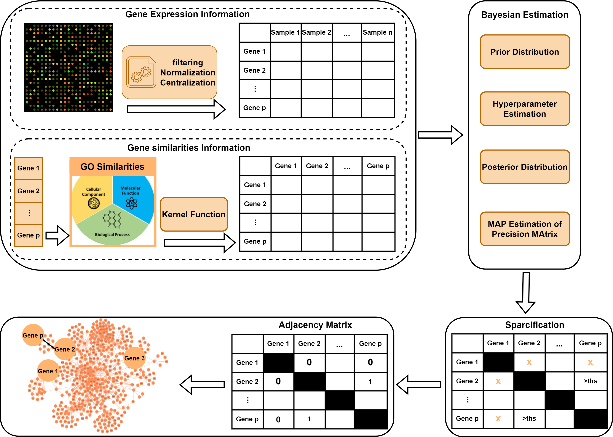
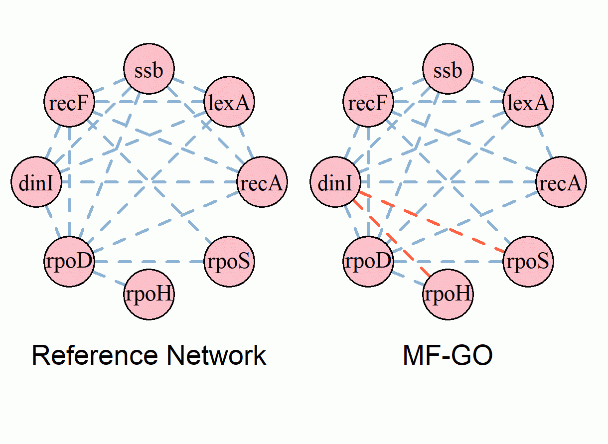

[](https://github.com/Maryam-Shahdoust/SimMapNet/issues) 

[](https://github.com/Maryam-Shahdoust/SimMapNet/releases)


## SimMapNet : Bayesian Estimation of Precision Matrix using additional Information about variable relationships 

## Discription : 
SimMapNet is an R package designed for estimating the precision matrix in a Bayesian framework while incorporating additional information about feature similarities. The package applies sparsity through quantile-based thresholding, making it well-suited for constructing structured biological networks.
The key innovation in SimMapNet is the integration of similarity-based information, which is transformed into a distance metric and incorporated into the covariance structure using kernel functions. The current version supports two kernel functions: the Gaussian(squared exponential) kernel and the Exponential(Ornstein-Uhlenbeck) kernel.
A primary application of SimMapNet is in the construction of biological networks, such as Gene Regulatory Networks (GRNs), within a Gaussian graphical model framework. In this context, additional information—such as Gene Ontology (GO) similarities between genes—can be leveraged to improve network inference.
SimMapNet provides a powerful approach for integrating biological knowledge into network estimation, enhancing the accuracy and interpretability of inferred relationships.  

## Table of Contents
- [Installation](#installation)
- [An Example for Constructing Gene Regulatory Network by SimMapNet: Constructing the SOS Gene Regulatory Network](#an-example-for-constructing-gene-regulatory-network-by-simmapnet-constructing-the-sos-gene-regulatory-network)
  - [Data Pre-processing](#data-pre-processing)
  - [GO Similarities](#go-similarities)
  - [Network Construction](#network-construction)
  - [Constructed Network Illustration](#constructed-network-illustration)


## Installation
```bash
install.packages("devtools")
devtools::install_github("maryam-shahdoust/SimMapNet")
```
## Required Packages

```bash
if (!requireNamespace("BiocManager", quietly=TRUE))
    install.packages("BiocManager")
## BiocManager::install("BiocUpgrade") ## you may need this
BiocManager::install("GOSemSim")

if (!requireNamespace("BiocManager", quietly = TRUE))
    install.packages("BiocManager")

BiocManager::install("org.EcK12.eg.db")
```


##   An Example for Constructing Gene Regulatory Network by SimMapNet : Constructing the SOS Gene Regulatory Network 
</div>

The SOS network in E. coli is a well-characterized gene regulatory network (GRN) responsible for the bacterial DNA damage response. In this study, we use SimMapNet to infer the SOS GRN by integrating gene expression data with GO similarity information.

SimMapNet takes as input a gene expression matrix and a gene distance matrix, estimating the precision matrix within a Bayesian framework. Sparsity is enforced using quantile-based thresholding, and the resulting sparse precision matrix is transformed into a binary adjacency matrix, representing the inferred regulatory network.

This approach allows the incorporation of prior biological knowledge through GO similarity-based distances, improving network inference accuracy.

**Data Pre-processing:**
The gene expression data(Y) has to be norlmalized and centralized. If data are not normalized, use a normalization transformation such as log2-transformation.   
The gene expression vectors for each sample are then centralized so that their corresponding means are adjusted to zero.
As an example, we applied this preprocessing pipeline to the SOS dataset:
``` bash
Data <- read.csv('SOS.data/SOS.data.csv')
Data.centralized <- scale(Data,center=TRUE,scale=FALSE)
Y <- Data.centralized
```

**GO Similarities:**
To integrate biological knowledge into network inference, we compute Gene Ontology (GO) similarities between genes. The GOSemSim package in R is used to quantify functional similarities based on GO annotations. Here, we compute similarities in the Molecular Function (MF) category, but other categories (Biological Process (BP) and Cellular Component (CC)) can also be used.
The GO similarity matrix serves as a prior knowledge source, helping refine the inferred gene regulatory network by integrating biological relevance into network construction.
```bash
# Load necessary libraries
library(GOSemSim)
library(org.EcK12.eg.db)  # Database for E. coli gene annotations
# Load GO data
ec_go <- godata('org.EcK12.eg.db', ont = "MF", computeIC = FALSE)
# Convert gene symbols to Entrez IDs
gene_symbols <- c("recA", "lexA", "ssb", "recF", "dinI", "rpoD", "rpoH", "rpoS")
entrez_ids <- mapIds(org.EcK12.eg.db, keys = gene_symbols, keytype = "SYMBOL", column = "ENTREZID")
# Remove NA values (unmapped genes)
entrez_ids <- na.omit(entrez_ids)
# Compute GO similarities
go_sim_matrix <- mgeneSim(entrez_ids, semData = ec_go, measure = "Wang")
# Convert GO similarities to distance matrix (1 - similarity)
distance_matrix <- 1 - go_sim_matrix
```
**Network Construction**

SimMapNet Arguments:
- **Y**: A numeric matrix (n × p) representing the data matrix with n samples and p genes.
- **nu**: A positive value (> p - 1) representing the prior degrees of freedom for the Wishart distribution.
- **distance**: A numeric matrix (p × p) representing the distance between genes, computed as 1 - GO similarities.
- **epsilon1**: A small positive value ensuring the positive definiteness of the prior covariance matrix (ω).
- **epsilon2**: A small positive value ensuring the positive definiteness of the final precision matrix.
- **alpha**: A positive value controlling the kernel width parameter.
- **kernel.id**: An integer (1 or 2) specifying the kernel function (1 for Gaussian, 2 for Exponential).
- **quantile_level**: A value in (0,1) specifying the quantile threshold for sparsification.
SimMapNet has two outputs, the estimation of precision matrix and the adjacency matrix(the binariazed estimation of precision matrix).

```bash
library(SimMapNet)
# Define parameters
nu <- 2*ncol(Data);epsilon1 <- 0.61;epsilon2 <- 0.0  
alpha <- 0.3;kernel.id <- 1;quantile_level <- 0.3

# Estimate the Adjacency Matrix
SOS_network <- SimMapNet(Y = Y, distance = distance_matrix, 
                         nu = nu, epsilon1 = epsilon1,    
                         epsilon2 = epsilon2,alpha = alpha,      
                         kernel.id = kernel.id,quantile_level = quantile_level)[[2]]
```

**Constructed Network illustration**

The constructed SOS gene regulatory network based on Molecular Function GO (MF-GO), along with the reference network representing the true interactions, is illustrated in the figure. Each node represents a gene, and each edge represents a relationship between genes. In the MF-GO network, true positive edges (correctly inferred interactions) are shown in blue, while false positive edges (incorrectly inferred interactions) are shown in red. Comparing the constructed network to the reference network, the F1-score, which is the harmonic mean of sensitivity and precision, is approximately 0.92.
</div>

