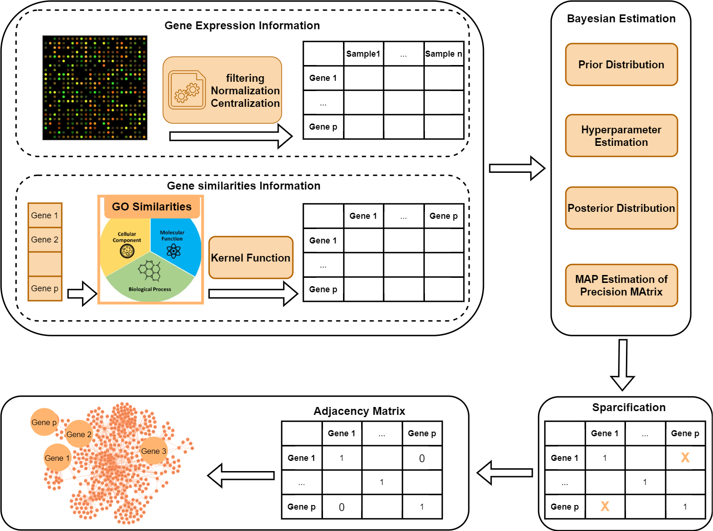

## SimMapNet : Bayesian Estimation of Precision Matrix using additional Information about variable relationships 

## Discription : 
SimMapNet is an R package designed for estimating the precision matrix in a Bayesian framework while incorporating additional information about feature similarities. The package applies sparsity through quantile-based thresholding, making it well-suited for constructing structured biological networks.
The key innovation in SimMapNet is the integration of similarity-based information, which is transformed into a distance metric and incorporated into the covariance structure using kernel functions. The current version supports two kernel functions: the squared exponential kernel and the exponential kernel.
A primary application of SimMapNet is in the construction of biological networks, such as Gene Regulatory Networks (GRNs), within a Gaussian graphical model framework. In this context, additional information—such as Gene Ontology (GO) similarities between genes—can be leveraged to improve network inference.
SimMapNet provides a powerful approach for integrating biological knowledge into network estimation, enhancing the accuracy and interpretability of inferred relationships.  

## Installation
```bash
install.packages("devtools")
devtools::install_github("maryam-shahdoust/SimMapNet")
```

##  🔬 An Example for Constructing Gene Regulatory Network by SimMapNet : Constructing the SOS Gene Regulatory Network 
</div>



The SOS network in E. coli is a well-known regulatory network involved in the bacterial DNA damage response. Here, we use SimMapNet to infer the SOS GRN using gene expression data and GO similarity information. The SimMapNet gets the gene expression matrix and the matrix of distance between genes and give the estimation of precision matrix which is sparced using quantile thresholding. This estimation transfer to a binary matrix as an adjacency matrix of the network.
